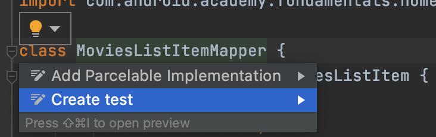
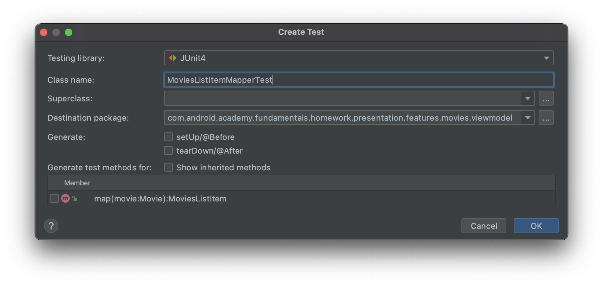
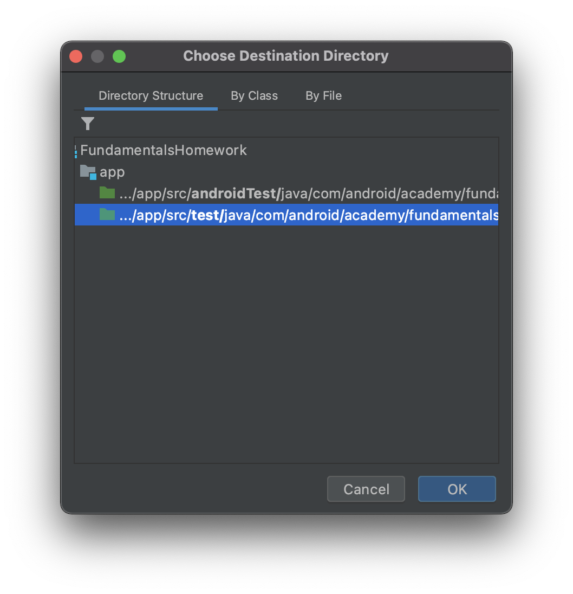
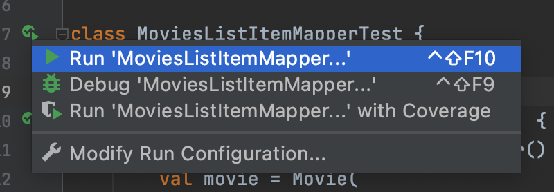
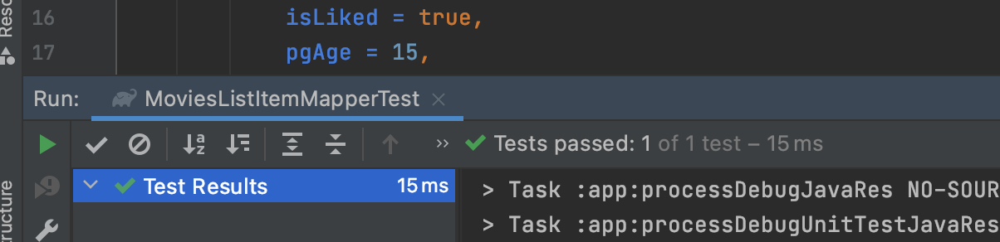
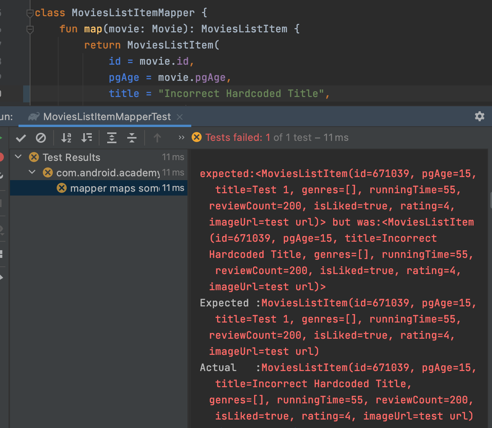

# Workshop 1

In first workshop we will create simple test for `MoviesListItemMapper`

## TODO 1.0

- Open `MoviesListItemMapper.kt`
- Move the cursor to the class name
- Press on a yellow bulb and select `Create test`

- Select `JUnit4` in `Testing library:` field

- Select `/test/` directory, not `/androidTest/`

- Create empty  `MoviesListItemMapperTest`

```kotlin 
class MoviesListItemMapperTest {

}
```

## TODO 1.1

- Create new empty test method inside of `MoviesListItemMapperTest`:

```kotlin 
@Test
fun `mapper maps some fields as is`() {

}
```

## TODO 1.2

- Create instance of `MoviesListItemMapper` in created test method:

```kotlin 
@Test
fun `mapper maps some fields as is`() {
    val mapper = MoviesListItemMapper()
}
 ```

## TODO 1.3

- Create `Movie` instance in test method:

```kotlin
val movie = Movie(
    id = 671039,
    title = "Test 1",
    reviewCount = 200,
    isLiked = true,
    pgAge = 15,
    runningTime = 55,
    imageUrl = "test url",
    genres = listOf(),
    rating = 4
)
```

So method will look like this:

```kotlin
@Test
fun `mapper maps some fields as is`() {
    val mapper = ...
    val movie = Movie(...)
}
```

## TODO 1.4

- Use created `MovieListItemMapper` to map `Movie` into `MoviesListItem`

```kotlin
@Test
fun `mapper maps some fields as is`() {
    val mapper = ...
    val movie = ...

    val listItem = mapper.map(movie)
}
```

## TODO 1.5

- Create instance of `MoviesListItem` with same data as in `Movie` model

```kotlin
val expectedMovieListItem = MoviesListItem(
    id = 671039,
    title = "Test 1",
    reviewCount = 200,
    isLiked = true,
    pgAge = 15,
    runningTime = 55,
    imageUrl = "test url",
    genres = listOf(),
    rating = 4
)
```

So method will look like this:

```kotlin
@Test
fun `mapper maps some fields as is`() {
    val mapper = ...
    val movie = ...

    val listItem = ...

    val expectedMovieListItem = MoviesListItem(...)
}
```

## TODO 1.6

- Use `assertEquals([expected], [actual])`  method to check equality of objects
  `expected` - model, you've created in `TODO 1.5`
  `actual` - mapped model, you've got in `TODO 1.4`

```kotlin
@Test
fun `mapper maps some fields as is`() {
    ...
    val expectedMovieListItem = ...
    assertEquals(expectedMovieListItem, listItem)
}
```

## TODO 1.7

- Run test:

- And see green result:

  
## TODO 1.8

- Try to break something in the  `MoviesListItemMapper`.
- Run the test and check how an error message looks

- Do not forget to fix `MoviesListItemMapper` to see green result again

# Summary

Finally, you should see something like that:

```kotlin
package com.android.academy.fundamentals.homework.presentation.features.movies.viewmodel

import com.android.academy.fundamentals.homework.model.Movie
import org.junit.Assert.assertEquals
import org.junit.Test

class MoviesListItemMapperTest {

    @Test
    fun `mapper maps some fields as is`() {
        val mapper = MoviesListItemMapper()
        val movie = Movie(
            id = 671039,
            title = "Test 1",
            reviewCount = 200,
            isLiked = true,
            pgAge = 15,
            runningTime = 55,
            imageUrl = "test url",
            genres = listOf(),
            rating = 4
        )

        val listItem = mapper.map(movie)

        val expectedMovieListItem = MoviesListItem(
            id = 671039,
            title = "Test 1",
            reviewCount = 200,
            isLiked = true,
            pgAge = 15,
            runningTime = 55,
            imageUrl = "test url",
            genres = listOf(),
            rating = 4
        )
        assertEquals(expectedMovieListItem, listItem)
    }
}
```