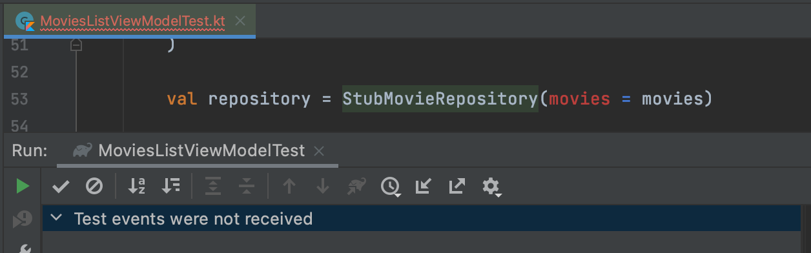
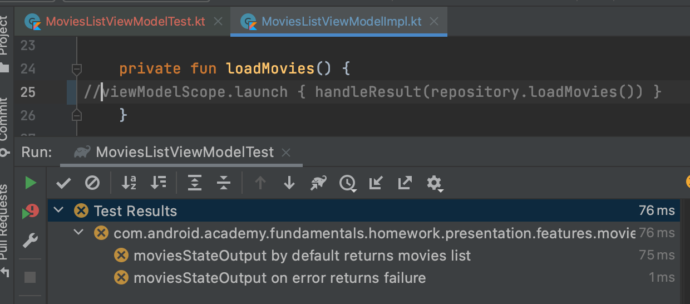

# Workshop 2

In this workshop we will test `ViewModel` and `LiveData`

# TODO 2.0 Let's create test for ViewModel

## TODO 2.0.0

- Open `MoviesListViewModel.kt`
- Move the cursor to the class name
- Press on a yellow bulb and select `Create test`
- Select `JUnit4` in `Testing library:` field
- Select `/test/` directory, not `/androidTest/`
- Create empty  `MoviesListViewModelTest`
- Also create `Rule` (use already created `viewModelTestingRules()`) for running code in single
  thread
  
- If you have some troubles with these steps, refer to images from Workshop 1

```kotlin
class MoviesListViewModelTest {
    @get:Rule
    val viewModelRule = viewModelTestingRules()
}
```

# TODO 2.1 Add Success Test Case

## TODO 2.1.0

- Create new empty test method inside of `MoviesListViewModelTest`:

```kotlin
@Test
fun `moviesStateOutput by default returns movies list`() {

}
```

## TODO 2.1.1

- Create or copy-paste list of `Movie` into created test:

```kotlin
val movies = listOf(
    Movie(
        id = 671039,
        title = "Bronx",
        reviewCount = 200,
        isLiked = false,
        rating = 4,
        pgAge = 13,
        genres = emptyList(),
        runningTime = 34,
        imageUrl = "test url"
    ),
    Movie(
        id = 724989,
        title = "Hard Kill",
        reviewCount = 151,
        isLiked = false,
        rating = 0,
        pgAge = 0,
        genres = listOf(Genre(1, "test")),
        runningTime = 0,
        imageUrl = null
    ),
    Movie(
        id = 400160,
        title = "The SpongeBob Movie: Sponge on the Run",
        reviewCount = 1395,
        isLiked = false,
        rating = 0,
        pgAge = 0,
        genres = emptyList(),
        runningTime = 0,
        imageUrl = null
    ),
)
```

So method will look like this:

```kotlin
@Test
fun `moviesStateOutput by default returns movies list`() {
    val movies = listOf(...)
}
```

## TODO 2.1.2

- Create instance of `StubMovieRepository` with created `Movie` list

```kotlin
@Test
fun `moviesStateOutput by default returns movies list`() {
    val movies = ...
    val repository = StubMovieRepository(movies = movies)
}
```

## TODO 2.1.3

- Create `MoviesListViewModelImpl` and provide `Movie` list and `MoviesListItemMapper ` into
  constructor.

```kotlin
@Test
fun `moviesStateOutput by default returns movies list`() {
    val movies = ...
    val repository = ...
    val viewModel = MoviesListViewModelImpl(repository, MoviesListItemMapper())
}
```

## TODO 2.1.4

- Create or copy-paste list of expected `MoviesListItem`

```kotlin
val mappedMovieList = listOf(
    MoviesListItem(
        id = 671039,
        title = "Bronx",
        reviewCount = 200,
        isLiked = false,
        rating = 4,
        pgAge = 13,
        genres = emptyList(),
        runningTime = 34,
        imageUrl = "test url"
    ),
    MoviesListItem(
        id = 724989,
        title = "Hard Kill",
        reviewCount = 151,
        isLiked = false,
        rating = 0,
        pgAge = 0,
        genres = listOf(Genre(1, "test")),
        runningTime = 0,
        imageUrl = null
    ),
    MoviesListItem(
        id = 400160,
        title = "The SpongeBob Movie: Sponge on the Run",
        reviewCount = 1395,
        isLiked = false,
        rating = 0,
        pgAge = 0,
        genres = emptyList(),
        runningTime = 0,
        imageUrl = null
    )
)
```

So method will look like this:

```kotlin
@Test
fun `moviesStateOutput by default returns movies list`() {
    ...
    val mappedMovieList = listOf(...)
}
```

## TODO 2.1.5

- Get `movieLoadedState` from our `ViewModel`
- Create `expectedState` from created `Movie` list

```kotlin
@Test
fun `moviesStateOutput by default returns movies list`() {
    ...
    val movieLoadedState = viewModel.moviesStateOutput.value
    val expectedState = MoviesListViewState.MoviesLoaded(mappedMovieList)
}
```

## TODO 2.1.6

- Use `assertEquals` to check `expectedState` and `movieLoadedState` equality

```kotlin
@Test
fun `moviesStateOutput by default returns movies list`() {
    ...
    assertEquals(expectedState, movieLoadedState)
}
```

## TODO 2.1.7

- Run Test and see green result. Then proceed to next step.

# TODO 2.2 Add Failure Test Case

## TODO 2.2.0

Now we need to refactor `StubMovieRepository` to give us ability to set different results in
different test cases

- Open `StubMovieRepository.kt`
- Remove `val movies: List<Movie> = emptyList()` from `StubMovieRepository` constructor
- Add next code to `StubMovieRepository`:

```kotlin
internal class StubMovieRepository() : MovieRepository {
    ...
    private var result: Result<List<Movie>> = Success(emptyList())

    fun setResult(movies: List<Movie>) {
        result = Success(movies)
    }

    fun setErrorResult() {
        result = Failure(Throwable())
    }
}
```

- Change `loadMovies()` return value from `Success(movies)`

```kotlin
internal class StubMovieRepository() : MovieRepository {
    ...
    override suspend fun loadMovies(): Result<List<Movie>> = Success(movies)
    ...
}
```

to `result`

```kotlin
internal class StubMovieRepository() : MovieRepository {
    ...
    override suspend fun loadMovies(): Result<List<Movie>> = result
    ...
}
```

## TODO 2.2.1

- Run tests to see something like this:



This means that something is broken

Now we need to fix the first test by removing `movies` from `StubMovieRepository` constructor and use `setResult(movies)` method
instead

- Open `MoviesListViewModelTest.kt`
- Change next code

```kotlin
@Test
fun `moviesStateOutput by default returns movies list`() {
    ...
    val repository = StubMovieRepository(movies = movies)
    ...
}
```

to

```kotlin
@Test
fun `moviesStateOutput by default returns movies list`() {
    ...
    val repository = StubMovieRepository()
    repository.setResult(movies)
    ...
}
```

## TODO 2.2.2

- Run tests again to see green result

## TODO 2.2.3

Now let's add new test for Failure scenario:

- Create new test and new instance of `StubMovieRepository`
- Add `setErrorResult()` to repository
- Create `MoviesListViewModelImpl` same way you did in previous test

So method will look like:

```kotlin
@Test
fun `moviesStateOutput on error returns failure`() {
    val repository = StubMovieRepository()
    repository.setErrorResult()
    val viewModel = MoviesListViewModelImpl(repository, MoviesListItemMapper())
}
```

## TODO 2.2.4

- Use `assertEquals` to check that value of `viewModel.moviesStateOutput` is `MoviesListViewState.FailedToLoad`

```kotlin
@Test
fun `moviesStateOutput on error returns failure`() {
    ...
    assertEquals(
        MoviesListViewState.FailedToLoad,
        viewModel.moviesStateOutput.value
    )
}
```

## TODO 2.2.5

- Run test and see green result

# TODO 2.3 Test your tests

- Try breaking something in the implementation to see that tests became red:



- If the tests stay green when the implementation is broken then you have an error in tests.

# Summary

Finally, you should see something like that:

### `MoviesListViewModelTest.kt`

```kotlin
package com.android.academy.fundamentals.homework.presentation.features.movies.viewmodel

import com.android.academy.fundamentals.homework.domain.StubMovieRepository
import com.android.academy.fundamentals.homework.model.Genre
import com.android.academy.fundamentals.homework.model.Movie
import com.android.academy.fundamentals.homework.utils.viewModelTestingRules
import org.junit.Assert.assertEquals
import org.junit.Rule
import org.junit.Test

class MoviesListViewModelTest {
    @get:Rule
    val viewModelRule = viewModelTestingRules()

    @Test
    fun `moviesStateOutput by default returns movies list`() {
        val movies = listOf(
            Movie(
                id = 671039,
                title = "Bronx",
                reviewCount = 200,
                isLiked = false,
                rating = 4,
                pgAge = 13,
                genres = emptyList(),
                runningTime = 34,
                imageUrl = "test url"
            ),
            Movie(
                id = 724989,
                title = "Hard Kill",
                reviewCount = 151,
                isLiked = false,
                rating = 0,
                pgAge = 0,
                genres = listOf(Genre(1, "test")),
                runningTime = 0,
                imageUrl = null
            ),
            Movie(
                id = 400160,
                title = "The SpongeBob Movie: Sponge on the Run",
                reviewCount = 1395,
                isLiked = false,
                rating = 0,
                pgAge = 0,
                genres = emptyList(),
                runningTime = 0,
                imageUrl = null
            ),
        )

        val repository = StubMovieRepository()
        repository.setResult(movies)
        val viewModel = MoviesListViewModelImpl(repository, MoviesListItemMapper())

        val mappedMovieList = listOf(
            MoviesListItem(
                id = 671039,
                title = "Bronx",
                reviewCount = 200,
                isLiked = false,
                rating = 4,
                pgAge = 13,
                genres = emptyList(),
                runningTime = 34,
                imageUrl = "test url"
            ),
            MoviesListItem(
                id = 724989,
                title = "Hard Kill",
                reviewCount = 151,
                isLiked = false,
                rating = 0,
                pgAge = 0,
                genres = listOf(Genre(1, "test")),
                runningTime = 0,
                imageUrl = null
            ),
            MoviesListItem(
                id = 400160,
                title = "The SpongeBob Movie: Sponge on the Run",
                reviewCount = 1395,
                isLiked = false,
                rating = 0,
                pgAge = 0,
                genres = emptyList(),
                runningTime = 0,
                imageUrl = null
            )
        )

        val movieLoadedState = viewModel.moviesStateOutput.value
        val expectedState = MoviesListViewState.MoviesLoaded(mappedMovieList)

        assertEquals(expectedState, movieLoadedState)
    }

    @Test
    fun `moviesStateOutput on error returns failure`() {
        val repository = StubMovieRepository()
        repository.setErrorResult()
        val viewModel = MoviesListViewModelImpl(repository, MoviesListItemMapper())
        assertEquals(MoviesListViewState.FailedToLoad, viewModel.moviesStateOutput.value)
    }
}
```

### `StubMovieRepository.kt`

```kotlin
package com.android.academy.fundamentals.homework.domain

import com.android.academy.fundamentals.homework.common.model.Failure
import com.android.academy.fundamentals.homework.common.model.Success
import com.android.academy.fundamentals.homework.model.Movie
import com.android.academy.fundamentals.homework.model.MovieDetails

internal class StubMovieRepository : MovieRepository {
    override suspend fun loadMovies(): Result<List<Movie>> = result
    override suspend fun loadMovie(movieId: Int): Result<MovieDetails> =
        TODO("Stub repository doesn't implement loadMovie method")

    private var result: Result<List<Movie>> = Success(emptyList())

    fun setResult(movies: List<Movie>) {
        result = Success(movies)
    }

    fun setErrorResult() {
        result = Failure(Throwable())
    }
}
```