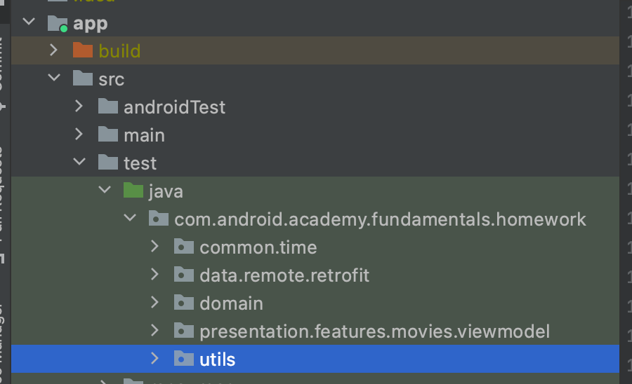

# Workshop 3

- Now we can refactor and simplify code from Workshop 1-2

# TODO 3.0 Let's add some factory methods

## TODO 3.0.0

- Open package `com.android.academy.fundamentals.homework.utils` in `test` directory

- Create `MovieFactory.kt` file in this package
- Create or copy-paste `createMovie(...)` factory method

```kotlin
fun createMovie(
    id: Int = 0,
    title: String = "",
    reviewCount: Int = 0,
    isLiked: Boolean = false,
    rating: Int = 0,
    pgAge: Int = 0,
    genres: List<Genre> = emptyList(),
    runningTime: Int = 0,
    imageUrl: String? = null
): Movie {
    return Movie(
        id = id,
        title = title,
        reviewCount = reviewCount,
        isLiked = isLiked,
        rating = rating,
        pgAge = pgAge,
        genres = genres,
        runningTime = runningTime,
        imageUrl = imageUrl
    )
}
```

## TODO 3.0.1

- Create `MapperFactory.kt` file in the same `/utils` package
- Create or copy-paste `createMapper(...)` factory method

```kotlin
fun createMapper() = MoviesListItemMapper()
```

## TODO 3.0.2

- Open `MoviesListItemMapperTest.kt`
- Use mapper factory method instead of constructor:

Change

```kotlin
@Test
fun `mapper maps some fields as is`() {
    val mapper = MoviesListItemMapper()
    ...
}
```

to

```kotlin
@Test
fun `mapper maps some fields as is`() {
    val mapper = createMapper()
    ...
}
```

## TODO 3.0.3

- Open `MoviesListViewModelImplTest.kt`
- Use mapper factory method instead of constructor:

Change

```kotlin
@Test
fun `moviesStateOutput by default returns movies list`() {
    ...
    val viewModel = MoviesListViewModelImpl(repository, MoviesListItemMapper())
    ...
}
```

to

```kotlin
@Test
fun `moviesStateOutput by default returns movies list`() {
    ...
    val viewModel = MoviesListViewModelImpl(repository, createMapper())
    ...
}
```

- Also use mapper factory method in `moviesStateOutput on error returns failure` test method:

So method will look like this:

```kotlin
@Test
fun `moviesStateOutput on error returns failure`() {
    ...
    val viewModel = MoviesListViewModelImpl(repository, createMapper())
    ...
}
```

# TODO 3.1 Refactor `MoviesListItemMapperTest`

## TODO 3.1.0

- Open `MoviesListItemMapperTest.kt`
- Replace the class name `Movie` with factory method call `createMovie`

Instead of

```kotlin
@Test
fun `mapper maps some fields as is`() {
    ...
    val movie = Movie(...)
    ...
}
```

use

```kotlin
@Test
fun `mapper maps some fields as is`() {
    ...
    val movie = createMovie(...)
    ...
}
```

## TODO 3.1.1

- Instead of `assertEquals` for whole `MoviesListItem` model use one `assertEquals()` for each
  parameter:

Instead of

```kotlin
@Test
fun `mapper maps some fields as is`() {
    ...
    val expectedMovieListItem = MoviesListItem(
        id = 671039,
        title = "Test 1",
        reviewCount = 200,
        isLiked = true,
        pgAge = 15,
        runningTime = 55,
        imageUrl = "test url",
        genres = listOf(),
        rating = 4
    )
    assertEquals(expectedMovieListItem, listItem)
}
```

use

```kotlin
@Test
fun `mapper maps some fields as is`() {
    ...
    assertEquals(671039, listItem.id)
    assertEquals("Test 1", listItem.title)
    assertEquals(200, listItem.reviewCount)
    assertEquals(true, listItem.isLiked)
    assertEquals(15, listItem.pgAge)
    assertEquals(55, listItem.runningTime)
    assertEquals("test url", listItem.imageUrl)
}
```

## TODO 3.1.2

- Run the test to check the changes.

# TODO 3.2 Refactor `MoviesListViewModelImplTest`

## TODO 3.2.0

Because we already tested `MoviesListItemMapper` and created `createMovie(...)` factory method, we
can simplify this code for creating `Movie`'s model only with id.

- Open `MoviesListViewModelImplTest.kt`
- Instead of `Movie` constructors use `createMovie(id = [1,2,...])` factory methods

Change

```kotlin
@Test
fun `moviesStateOutput by default returns movies list`() {
    val movies = listOf(
        Movie(...),
        Movie(...),
        Movie(...)
    )
    ...
}
```

to

```kotlin
@Test
fun `moviesStateOutput by default returns movies list`() {
    val movies = listOf(
        createMovie(id = 1),
        createMovie(id = 2),
        createMovie(id = 3)
    )
    ...
}

```

## TODO 3.2.1

- Remove `val mappedMovieList = listOf(...)` from first test - now, when we check only `id`'s, whole
  list creation is not needed

## TODO 3.2.2

Now we can check only `id`'s from viewmodel's output and remove previous `assertEquals()` method:

- Delete `val expectedState = ...` - we don't need it anymore
  
- Safely cast viewmodel's output to `MoviesListViewState.MoviesLoaded`

Change 

```kotlin
@Test
fun `moviesStateOutput by default returns movies list`() {
    ...
    val movieLoadedState = viewModel.moviesStateOutput.value
    ...
}

```

to

```kotlin
@Test
fun `moviesStateOutput by default returns movies list`() {
    ...
    val movieLoadedState =
        viewModel.moviesStateOutput.value as? MoviesListViewState.MoviesLoaded
    ...
}

```

- Map `movieLoadedState` to it `id`'s and then use `assertEquals` with simple `listOf(1,2,3)` (you can remove previous `assertEquals`)

Change 

```kotlin
@Test
fun `moviesStateOutput by default returns movies list`() {
    ...
    assertEquals(expectedState, movieLoadedState)
}
```

to 

```kotlin
@Test
fun `moviesStateOutput by default returns movies list`() {
    ...
    assertEquals(
        listOf(1, 2, 3),
        movieLoadedState?.movies?.map { it.id }
    )
}
```

## TODO 3.2.3

- Open `MoviesListViewModelImplTest.kt`
- Create factory method for `MoviesListViewModelImpl`

```kotlin
class MoviesListViewModelImplTest {
    ...

    private fun createMoviesListViewModel(repository: MovieRepository): MoviesListViewModel =
        MoviesListViewModelImpl(repository, createMapper())
}
```

- Use factory instead of `MoviesListViewModelImpl` constructor:

Change

```kotlin
@Test
fun `moviesStateOutput by default returns movies list`() {
    ...
    val viewModel = MoviesListViewModelImpl(repository, createMapper())
    ...
}
```

to

```kotlin
@Test
fun `moviesStateOutput by default returns movies list`() {
    ...
    val viewModel = createMoviesListViewModel(repository)
    ...
}
```

Also change 

```kotlin
@Test
fun `moviesStateOutput on error returns failure`() {
    ...
    val viewModel = MoviesListViewModelImpl(repository, createMapper())
    ...
}
```

to

```kotlin
@Test
fun `moviesStateOutput on error returns failure`() {
    ...
    val viewModel = createMoviesListViewModel(repository)
    ...
}
```

## TODO 3.2.4

- Run all refactored tests to check them works

# Summary

Finally, you should see something like that:

### `MovieFactory.kt`

```kotlin
package com.android.academy.fundamentals.homework.utils

import com.android.academy.fundamentals.homework.model.Genre
import com.android.academy.fundamentals.homework.model.Movie

fun createMovie(
    id: Int = 0,
    title: String = "",
    reviewCount: Int = 0,
    isLiked: Boolean = false,
    rating: Int = 0,
    pgAge: Int = 0,
    genres: List<Genre> = emptyList(),
    runningTime: Int = 0,
    imageUrl: String? = null
): Movie {
    return Movie(
        id = id,
        title = title,
        reviewCount = reviewCount,
        isLiked = isLiked,
        rating = rating,
        pgAge = pgAge,
        genres = genres,
        runningTime = runningTime,
        imageUrl = imageUrl
    )
}
```

### `MoviesListItemMapperTest.kt`

```kotlin
package com.android.academy.fundamentals.homework.presentation.features.movies.viewmodel

import com.android.academy.fundamentals.homework.model.createMovie
import org.junit.Assert.assertEquals
import org.junit.Test

class MoviesListItemMapperTest {

    @Test
    fun `mapper maps some fields as is`() {
        val mapper = createMapper()
        val movie = createMovie(
            id = 671039,
            title = "Test 1",
            reviewCount = 200,
            isLiked = true,
            pgAge = 15,
            runningTime = 55,
            imageUrl = "test url",
            genres = listOf(),
            rating = 4
        )

        val listItem = mapper.map(movie)

        assertEquals(671039, listItem.id)
        assertEquals("Test 1", listItem.title)
        assertEquals(200, listItem.reviewCount)
        assertEquals(true, listItem.isLiked)
        assertEquals(15, listItem.pgAge)
        assertEquals(55, listItem.runningTime)
        assertEquals("test url", listItem.imageUrl)
    }
}
```

### `MoviesListViewModelImplTest.kt`

```kotlin
package com.android.academy.fundamentals.homework.presentation.features.movies.viewmodel

import com.android.academy.fundamentals.homework.domain.MovieRepository
import com.android.academy.fundamentals.homework.domain.StubMovieRepository
import com.android.academy.fundamentals.homework.model.createMovie
import com.android.academy.fundamentals.homework.utils.viewModelTestingRules
import org.junit.Assert.assertEquals
import org.junit.Rule
import org.junit.Test

class MoviesListViewModelImplTest {
    @get:Rule
    val viewModelRule = viewModelTestingRules()

    @Test
    fun `moviesStateOutput by default returns movies list`() {
        val movies = listOf(
            createMovie(id = 1),
            createMovie(id = 2),
            createMovie(id = 3)
        )

        val repository = StubMovieRepository()
        repository.setResult(movies)
        val viewModel = createMoviesListViewModel(repository)

        val movieLoadedState =
            viewModel.moviesStateOutput.value as? MoviesListViewState.MoviesLoaded

        assertEquals(
            listOf(1, 2, 3),
            movieLoadedState?.movies?.map { it.id }
        )
    }

    @Test
    fun `moviesStateOutput on error returns failure`() {
        val repository = StubMovieRepository()
        repository.setErrorResult()
        val viewModel = createMoviesListViewModel(repository)
        assertEquals(MoviesListViewState.FailedToLoad, viewModel.moviesStateOutput.value)
    }

    private fun createMoviesListViewModel(repository: MovieRepository): MoviesListViewModel =
        MoviesListViewModelImpl(repository, createMapper())
}
```


